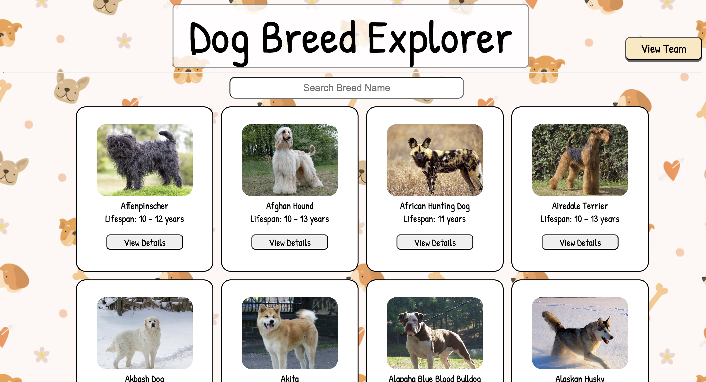
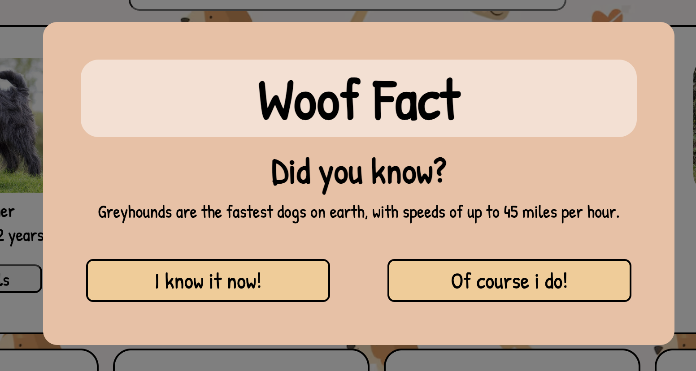
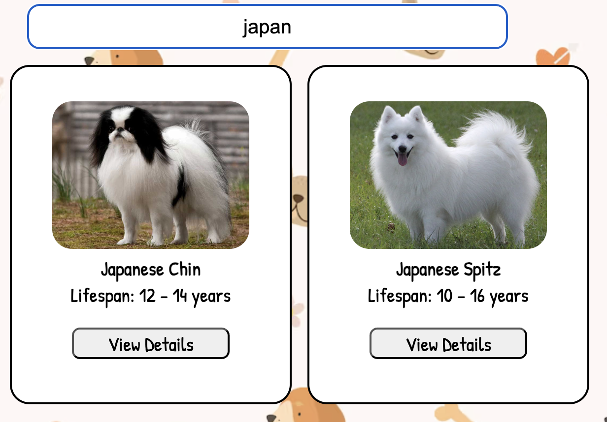
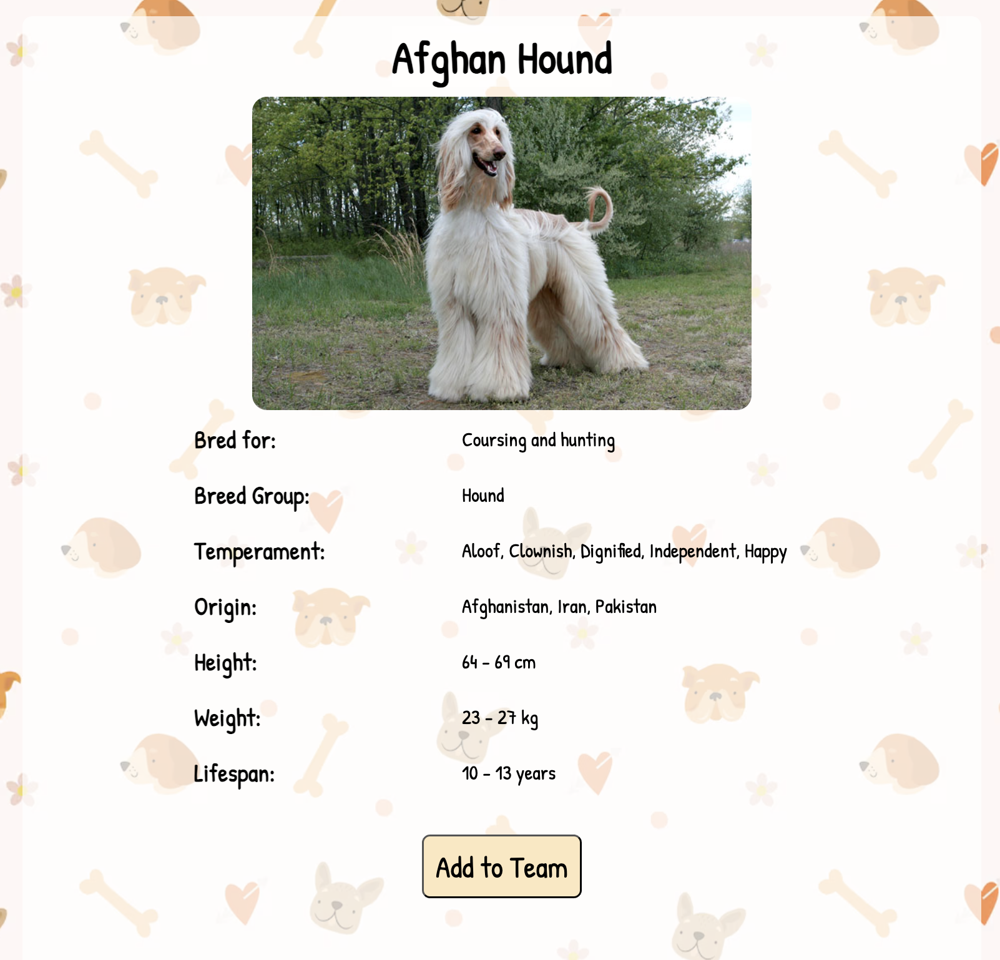
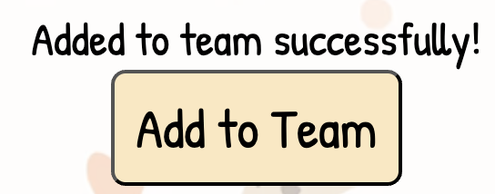
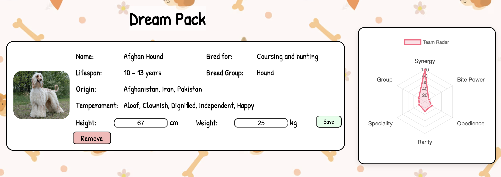
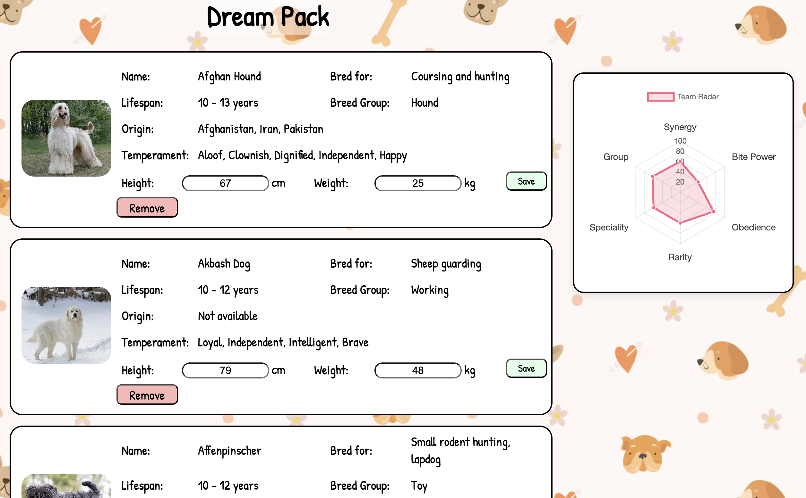
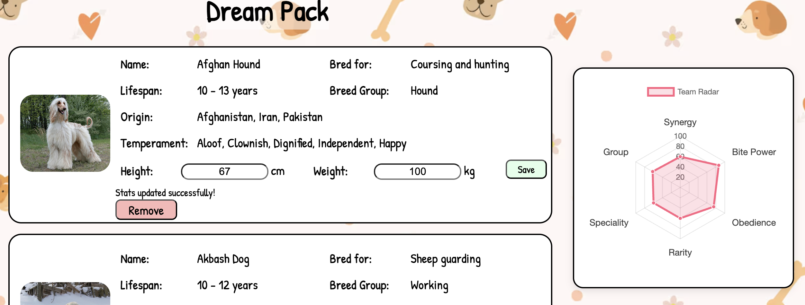
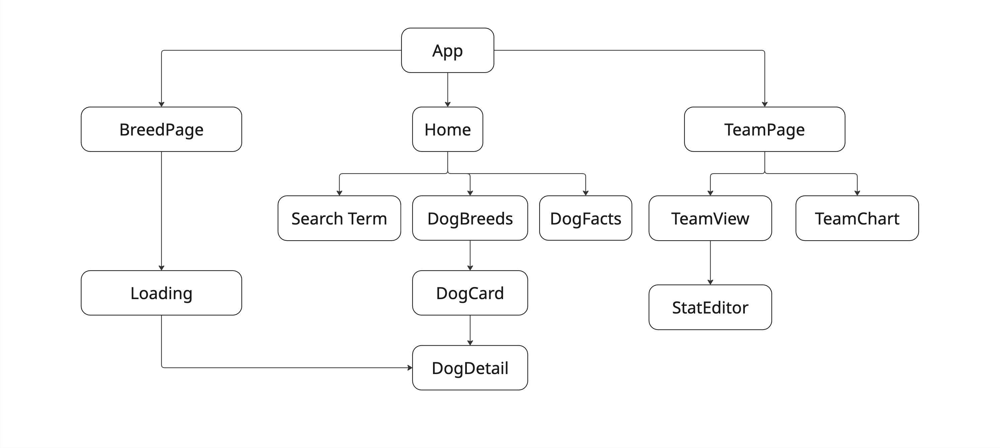

# The League of Good Pups

The League of Good Pups is a React app where you get to build your ultimate team of dog breeds. Each pup brings its own unique stats, from temperament to lifespan and more. You can browse detailed breed info, add pups to your pack, and see how different combos change your team’s stats. There’s no rulebook, it’s up to you to figure out what makes the perfect squad. Your team is saved with Airtable, so you can come back and keep tweaking your dream pack anytime!

## Features

- Build a custom dog team from real breed data
- Visualize team stats with interactive charts
- Search breeds by name
- Edit height and weight stats per dog
- Data persisted using Airtable
- Discover fun dog facts on first launch

## A Friendly Fact to Start With

When you first open the app, you’ll be greeted with a fun random dog fact (_just once_)! We’ve made sure it won’t pop up every time you return to the homepage, so it stays fun (not annoying). Select your answer and we promise we don't judge 😏

## Find Your Fave by Name

Looking for a specific breed? Just start typing in the search bar and the results will instantly update to match your input. No distractions, just the pup you're loyal to!

## Building Your Dream Pack

Before committing a pup to your dream pack, take a moment to explore their details. Every. Stat. Counts!

Once you’re ready, hit that add button and wait for the success message (We promise we’re off fetching your new puppy!)

## Evolving Team Stats

Start by adding your first pup to the team! The chart will come alive with their stats!

Add another… and uh-oh, synergy dropped! Turns out more pups = more chaos. Choose wisely!

Want to experiment? Try editing a dog’s height and weight and watch the stats magically shift.

> Pro tip: Unique traits can influence the chart too!

## Tech Stack

- React: Core framework for building the UI
- CSS Modules: For component-scoped styling
- Chart.js: For dynamic data visualization (team stats chart)
- Airtable: As the backend/database for storing team data

## Hierarchy

## Environment Variables

VITE_AIRTABLE_TEAM_URL=your_airtable_url
VITE_AIRTABLE_API_KEY=your_airtable_key
VITE_SERVER_DOGFACTS=your_dogfacts_url
VITE_SERVER_DOGBREED=your_dogdataapi_url
VITE_DOGBREED_API_KEY=your_dogdataapi_key

## ⚠️ Disclaimer

All dog stat calculations (like power, synergy, and more) in this app are purely fictional and based on my own logic, not scientific or veterinary data. Please don’t use them to make real-world decisions about your pets. This app is just for fun!

## Author

**Madeline Lim**

Built with love, barks, and the occasional “is that a real breed?” moment.

Feel free to fork, explore, or add your own twist (bonus points for pup GIFs).
